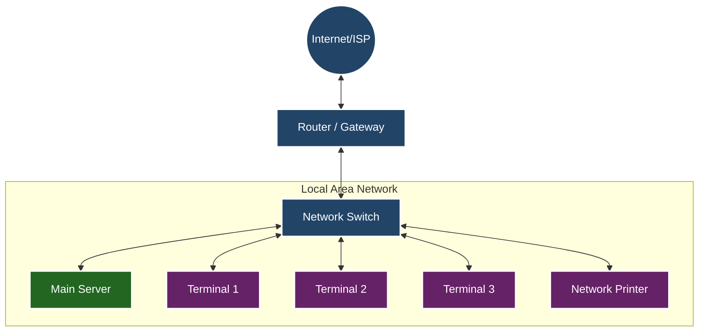

# Network Topology: LAN with Server and Terminals

This document illustrates the network topology for a Local Area Network (LAN) setup containing a central server and multiple terminals (e.g., POS stations), interconnected via a network switch.

## Topology Diagram

## Component Details

1.  **Main Server**: Hosts the database and backend services (e.g., Flask API). It processes transactions from all terminals.
2.  **Network Switch**: Connects all devices within the LAN, allowing efficient communication between terminals and the server.
3.  **Terminals (1-3)**: Client devices (e.g., POS registers) running the frontend application (e.g., React). They connect to the server to fetch data and submit transactions.
4.  **Router / Gateway**: Manages traffic between the internal LAN and the external Internet (if required for cloud syncing or updates).
5.  **Network Printer**: (Optional) specific hardware shared across the network for printing receipts or reports.

## Offline Functionality

**Yes, this topology works perfectly offline.**

The core components (Server, Switch, Terminals, Printer) form a self-contained **Local Area Network (LAN)**.
*   **Transactions**: Terminals communicate directly with the **Main Server** via the **Switch**. This path (Switch <--> Server <--> Terminals) does **not** require internet access.
*   **Data Storage**: All transaction data is stored locally on the Main Server's database.
*   **Printing**: Receipt printing commands are sent over the local network to the printer.

**What stops working without Internet:**
*   Remote access to the server from outside the store.
*   Cloud backups or syncing to a headquarters database (if applicable).
*   Credit card processing *if* the payment terminals require a direct connection to the payment processor's cloud (unless they have cellular backup or store-and-forward capabilities).
