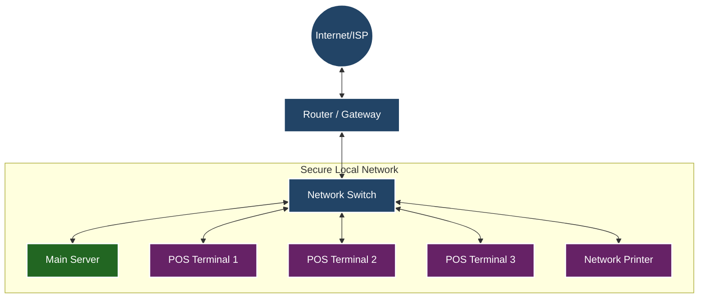

# Network Infrastructure Proposal
**Project:** Local Area Network (LAN) for POS System
**Date:** January 4, 2026

## 1. Executive Summary

This proposal outlines a robust and reliable network infrastructure designed to support your Point of Sale (POS) operations. The proposed architecture prioritizes **uptime**, **speed**, and **offline resilience**, ensuring that your business continues to operate smoothly even without an active internet connection.

## 2. System Architecture

The core of the system is a high-speed Local Area Network (LAN) that connects all terminals directly to a central server.

## 3. Key Operational Benefits

### ✅ 100% Offline Capability
Your business operations are critical and cannot depend on the stability of an external internet provider.
*   **Continuous Trading:** All POS terminals communicate directly with the local server. You can process sales, print receipts, and manage orders completely offline.
*   **Data Integrity:** All transaction data is safely stored on the local server immediately.

### 🚀 High Performance
*   **Low Latency:** By keeping traffic within the local network, communication between the POS and the server is instantaneous, resulting in faster checkout times compared to cloud-only solutions.
*   **Reliability:** The wired connection via the Network Switch ensures a stable connection free from Wi-Fi interference.

## 4. Hardware Requirements

| Component | Role | Recommendation |
| :--- | :--- | :--- |
| **Main Server** | Central database & application host | Dedicated PC/Server with SSD storage and backup power (UPS). |
| **Network Switch** | Connectivity hub | Gigabit Ethernet Switch (8+ ports). |
| **POS Terminals** | Staff interface | Touch-screen PC or Tablet with Ethernet support. |
| **Router** | External access | Standard business router (for updates/remote access). |

## 5. Conclusion

This topology provides a professional, enterprise-grade foundation for your business. It minimizes risk by removing the internet as a single point of failure and ensures that your staff can work efficiently at all times.
